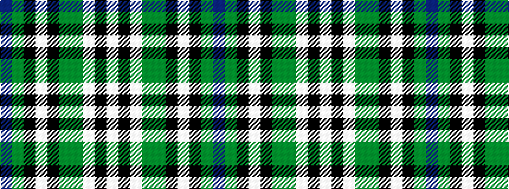

BGKWKGGWKW

It is a 10 stripe tartan.

<figure class="pat-woven">

<figcaption>idealised sample</figcaption>
</figure>

## Colour Sequence



## Tartans with this colour sequence

| Tartans |
|---------------|
| [Montgomery, Stuart (Personal)](/setts/s10/db6gi24k1w2k1gi24g24w3k1w3~x2/)|
||
