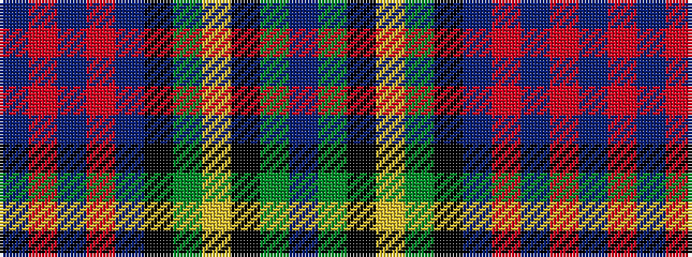

BGKYGKBRBRB

It is a 11 stripe tartan.

<figure class="pat-woven">

<figcaption>idealised sample</figcaption>
</figure>

## Colour Sequence



## Tartans with this colour sequence

| Tartans |
|---------------|
| [Unidentified #7](/setts/s11/db2r2db2r2db20k24dg12ly1k2dg2t2~x2/)|
||
| [Unidentified 26](/setts/s11/db2r2db2r2db20k24g12ly1k2g2t2~x2/)|
||
