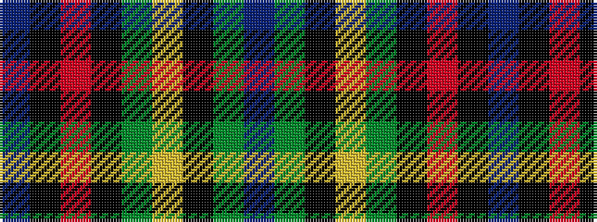

BGKYGKRKB

It is a 9 stripe tartan.

<figure class="pat-woven">

<figcaption>idealised sample</figcaption>
</figure>

## Colour Sequence



## Tartans with this colour sequence

| Tartans |
|---------------|
| [Roderick, Dhu](/variants/s9/db4k1r2k32g32ly2k1g3t2~x2/)|
||
