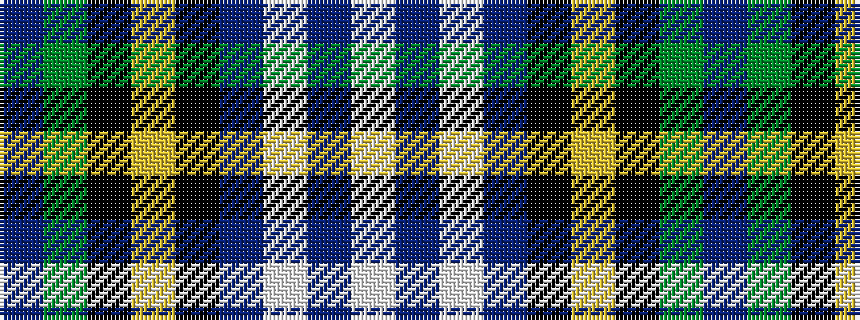

BGKYKBWBW

It is a 9 stripe tartan.

<figure class="pat-woven">

<figcaption>idealised sample</figcaption>
</figure>

## Colour Sequence



## Tartans with this colour sequence

| Tartans |
|---------------|
| [Scottish Cultural Society (Corporate](/variants/s9/dp2g4k8lo1k1db4lb1db1lb2~x8/)|
||
| [Scottish Cultural Society Ltd](/variants/s9/w3db1w1db3k1ly1k8g3p2~x2/)|
||
