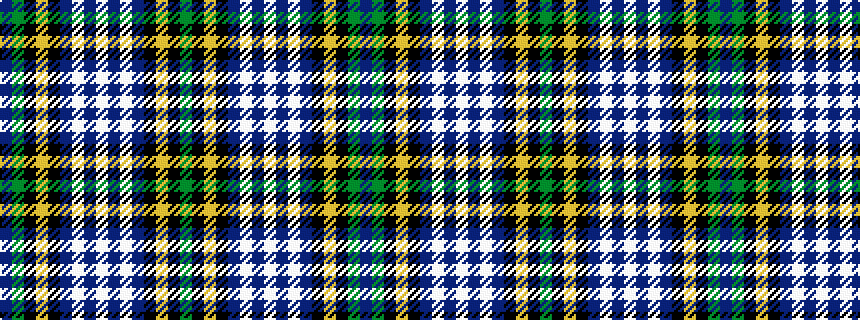

BGKYKBWBWBWBKYKG

It is a 16 stripe tartan.

<figure class="pat-woven">

<figcaption>idealised sample</figcaption>
</figure>

## Colour Sequence



## Tartans with this colour sequence

| Tartans |
|---------------|
| [Scottish Cultural Society](/variants/s16/g4k8lo1k1db4lb1db1lb2db1lb1db4k1lo1k8g4dp2~x8/)|
||
