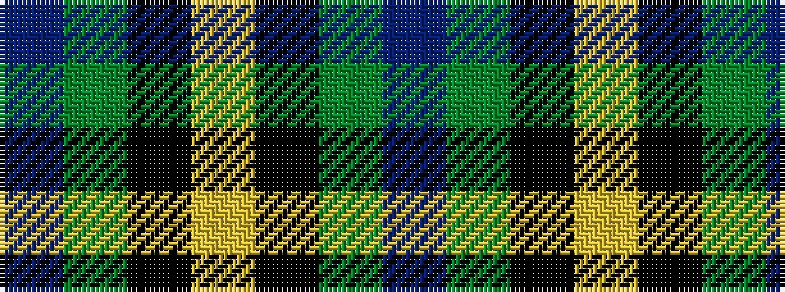

BGKYKGB

It is a 7 stripe tartan.

<figure class="pat-woven">

<figcaption>idealised sample</figcaption>
</figure>

## Colour Sequence



## Tartans with this colour sequence

| Tartans |
|---------------|
| [Salvation Army Htg (Corporate)](/variants/s7/db5dg8k1ly2k1dg8db4~x4/)|
||
| [Salvation Army, Hunting](/variants/s7/db40g8k1ly2k1g8db5~x4/)|
||
