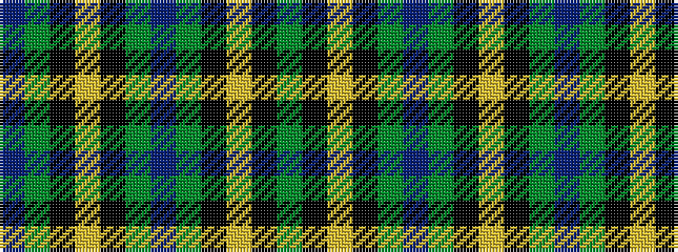

BGKYKGBGKYKG

It is a 12 stripe tartan.

<figure class="pat-woven">

<figcaption>idealised sample</figcaption>
</figure>

## Colour Sequence



## Tartans with this colour sequence

| Tartans |
|---------------|
| [Salvation Army Hunting](/variants/s12/dg8k1ly2k1dg8db4dg8k1ly2k1dg8db5~x4/)|
||
