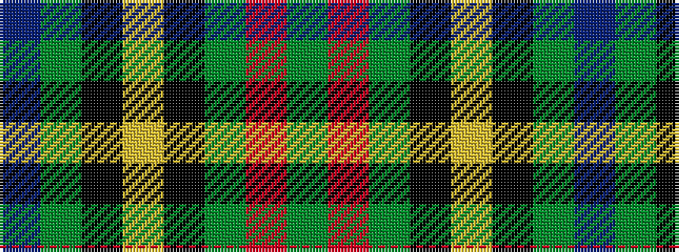

BGKYKGRG

It is a 8 stripe tartan.

<figure class="pat-woven">

<figcaption>idealised sample</figcaption>
</figure>

## Colour Sequence



## Tartans with this colour sequence

| Tartans |
|---------------|
| [Livingstone Aus. Dress (Personal)](/variants/s8/db24g4k2ly1k2g4r25g15~x2/)|
||
