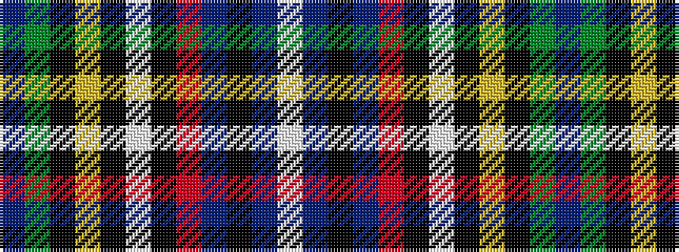

BGKYKWKRBKBW

It is a 12 stripe tartan.

<figure class="pat-woven">

<figcaption>idealised sample</figcaption>
</figure>

## Colour Sequence



## Tartans with this colour sequence

| Tartans |
|---------------|
| [Broager (Name)](/setts/s12/db53g10k20ly5k5w5k7r18db10k6db6w6/)|
||
