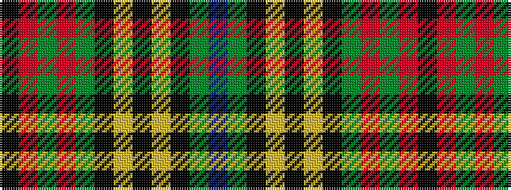

BGKYKYKGRGRK

It is a 12 stripe tartan.

<figure class="pat-woven">

<figcaption>idealised sample</figcaption>
</figure>

## Colour Sequence



## Tartans with this colour sequence

| Tartans |
|---------------|
| [Cats (Fashion)](/setts/s12/db8g2k2lo2k2ly2k2g18r2g2r29k3~x2/)|
||
