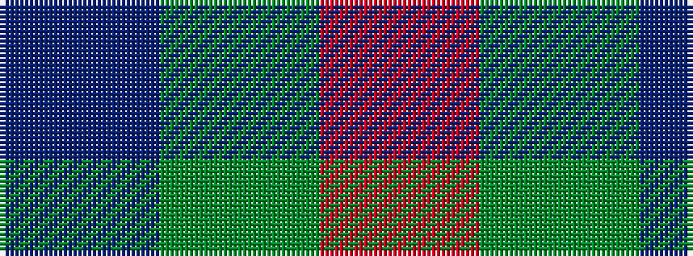

BGR

It is a 3 stripe tartan.

<figure class="pat-woven">

<figcaption>idealised sample</figcaption>
</figure>

## Colour Sequence



## Tartans with this colour sequence

| Tartans |
|---------------|
| [Agnew](/tartans/db53g42r14/)|
||
| [Ferguson](/setts/s3/db6dg5r1~x4/)|
||
| [Ferguson](/setts/s3/db6g5r1~x4/)|
||
| [Gyle (Corporate)](/setts/s3/t8dg1r2~x20/)|
||
| [Wilson's No 84, Ferguson](/setts/s3/db5g6r1~x4/)|
||
| [Wilson's No.061](/setts/s3/r4dg7t4~x2/)|
||
| [Wilson's, No 188](/setts/s3/r4g2t1~x4/)|
||
| [Wilson's, No 207](/setts/s3/r2g2t1~x4/)|
||
| [Wilson's, No 61](/setts/s3/r4g7t4~x2/)|
||
