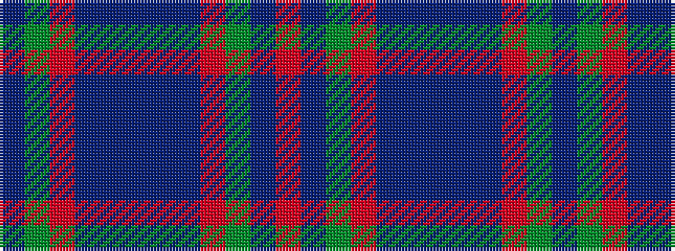

BGRBBBBBRGBR

It is a 12 stripe tartan.

<figure class="pat-woven">

<figcaption>idealised sample</figcaption>
</figure>

## Colour Sequence



## Tartans with this colour sequence

| Tartans |
|---------------|
| [Unidentified Cant #12](/setts/s12/r60db2g24r8db2t3db2/)|
||
