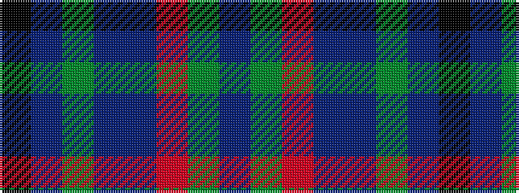

BGRBBGBK

It is a 8 stripe tartan.

<figure class="pat-woven">

<figcaption>idealised sample</figcaption>
</figure>

## Colour Sequence



## Tartans with this colour sequence

| Tartans |
|---------------|
| [Young](/setts/s8/k3db3g15dbi15dp5o3y2dp1~x2/)|
||
