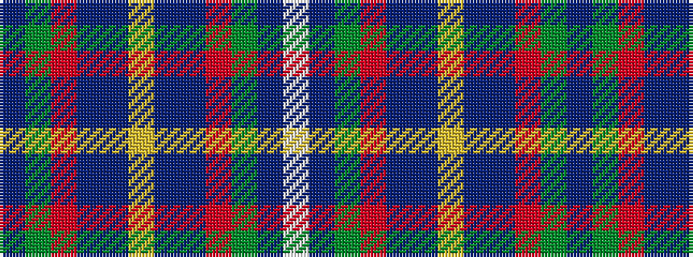

BGRBBYBBRGBW

It is a 12 stripe tartan.

<figure class="pat-woven">

<figcaption>idealised sample</figcaption>
</figure>

## Colour Sequence



## Tartans with this colour sequence

| Tartans |
|---------------|
| [Roseline](/setts/s12/db5dg9r3db18dr80ly3dr40db18r3dg9db5w2~x2/)|
||
