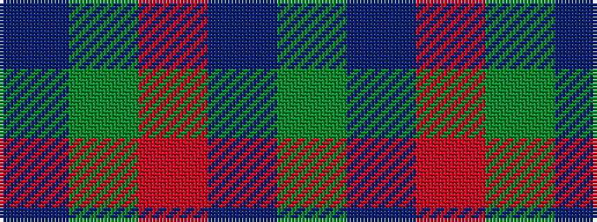

BGRBG

It is a 5 stripe tartan.

<figure class="pat-woven">

<figcaption>idealised sample</figcaption>
</figure>

## Colour Sequence



## Tartans with this colour sequence

| Tartans |
|---------------|
| [Harmony 8](/setts/s5/dr2y10o15dr10y2~x4/)|
||
| [Harmony, 6](/setts/s5/dp2g10o15dp10g2~x4/)|
||
