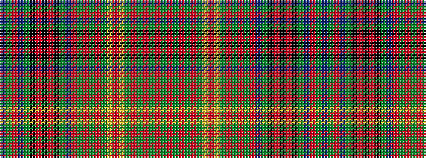

BGRBGKRKRKGBRGRGRGYRYGRGRGRG

It is a 28 stripe tartan.

<figure class="pat-woven">

<figcaption>idealised sample</figcaption>
</figure>

## Colour Sequence



## Tartans with this colour sequence

| Tartans |
|---------------|
| [MacMaster (New) Family Tartan Tartan Number: 3218. Earliest known date: 2001 Asymetrical design follows Canadian tradition. Elements of the MacInnes and the Nova Scotia tartans were included in line with Dave McMaster's family history. See products available Copyright © Blair Urquhart, Comrie, 2015](/setts/s28/g12r12g2r2g2r2g6ly2r1ly2g6r2g2r2g2r12db8g8k2r4k2r4k2g8db8r12g12t2~x2/)|
||
