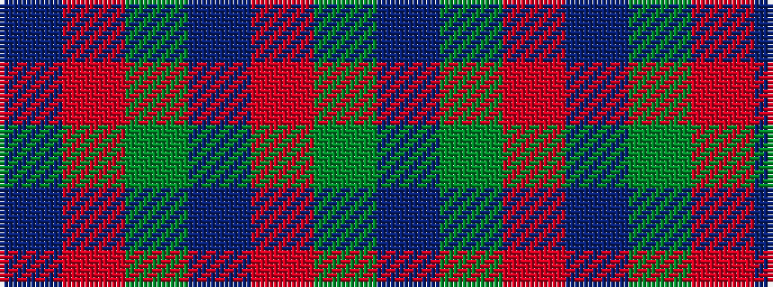

BGRBGRB

It is a 7 stripe tartan.

<figure class="pat-woven">

<figcaption>idealised sample</figcaption>
</figure>

## Colour Sequence



## Tartans with this colour sequence

| Tartans |
|---------------|
| [Scottish Netball (1986) (Corporate)](/setts/s7/dp3g14m2dp10g2m14dp3~x2/)|
||
| [Scottish Netball Association](/setts/s7/p3r14g2p10r2g14p3~x2/)|
||
| [Scottish Netball Association](/setts/s7/dp3dg14r2dp10dg2r14dp3~x2/)|
||
