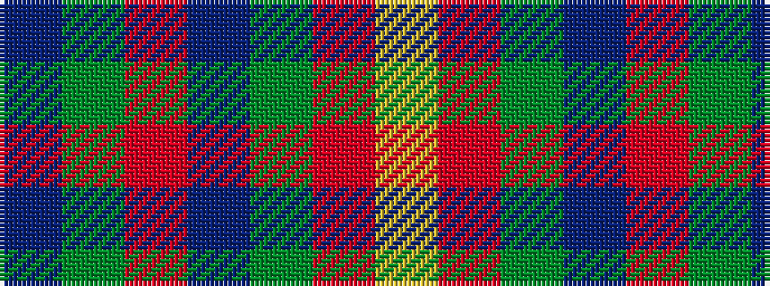

BGRBGRY

It is a 7 stripe tartan.

<figure class="pat-woven">

<figcaption>idealised sample</figcaption>
</figure>

## Colour Sequence



## Tartans with this colour sequence

| Tartans |
|---------------|
| [Fibonacci7](/setts/s7/db13dg8r5db3dg2r1ly1~x4/)|
||
