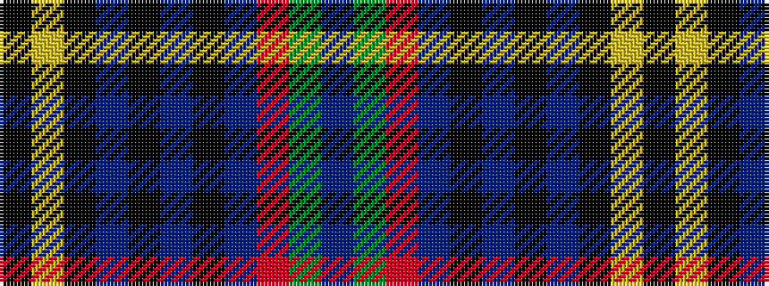

BGRBKBKBKYK

It is a 11 stripe tartan.

<figure class="pat-woven">

<figcaption>idealised sample</figcaption>
</figure>

## Colour Sequence



## Tartans with this colour sequence

| Tartans |
|---------------|
| [Lawtie (Personal)](/setts/s11/k20lr2k8dt2k2dt2k2dt10r5g5dt15~x2/)|
||
