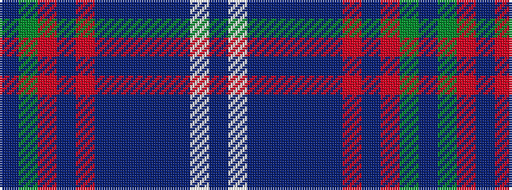

BGRBRBBBBBWB

It is a 12 stripe tartan.

<figure class="pat-woven">

<figcaption>idealised sample</figcaption>
</figure>

## Colour Sequence



## Tartans with this colour sequence

| Tartans |
|---------------|
| [Historic Scotland (1998) (Corporate)](/variants/s12/db8w8db4dp4db36dp4db4o26db2o26g2db5/)|
||
