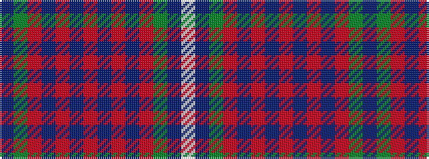

BGRBRBRBRBRGBW

It is a 14 stripe tartan.

<figure class="pat-woven">

<figcaption>idealised sample</figcaption>
</figure>

## Colour Sequence



## Tartans with this colour sequence

| Tartans |
|---------------|
| [MacGuire Irish Family Tartan](/variants/s14/w10db3g30r4t12r30t6r6t6r6t6r30g30dt4/)|
||
