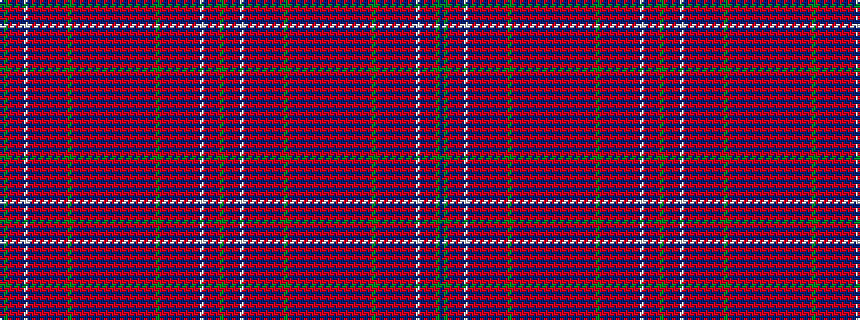

BGRBRBWBRBRBRBRBRGRBRBRBRBRBRBRBRBRBRBRGRBRBRBRBRBWBRBRG

It is a 56 stripe tartan.

<figure class="pat-woven">

<figcaption>idealised sample</figcaption>
</figure>

## Colour Sequence



## Tartans with this colour sequence

| Tartans |
|---------------|
| [Hebrides South Uist #4](/variants/s56/r4db24r2db1r8db1r3db24r3db2r2g7r2db2r3db24r2db1r8db1r2db24w1db2r2db2r2g2db2~x2/)|
||
