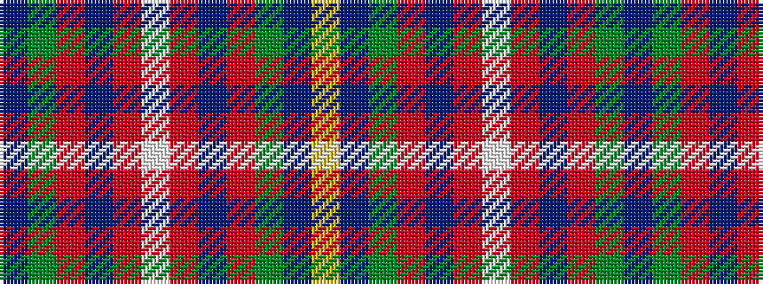

BGRBRWRBRGBY

It is a 12 stripe tartan.

<figure class="pat-woven">

<figcaption>idealised sample</figcaption>
</figure>

## Colour Sequence



## Tartans with this colour sequence

| Tartans |
|---------------|
| [Deeside Plaid (Taobh Dhi)](/setts/s12/b22g4o24dp6o4w3o4dp6o24g4b22ly4~x2/)|
||
