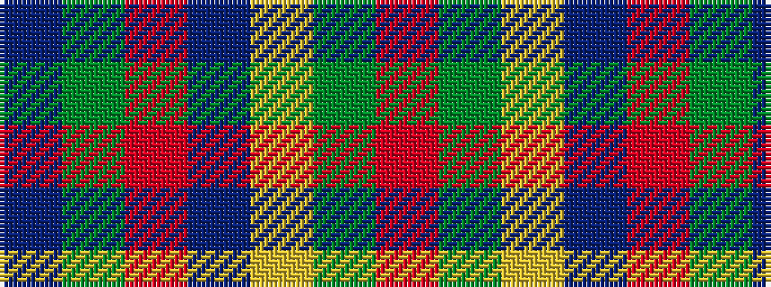

BGRBYGR

It is a 7 stripe tartan.

<figure class="pat-woven">

<figcaption>idealised sample</figcaption>
</figure>

## Colour Sequence



## Tartans with this colour sequence

| Tartans |
|---------------|
| [Kilkenny, County (District)](/setts/s7/dr4dg27o2db25lo5dg3o3~x2/)|
||
