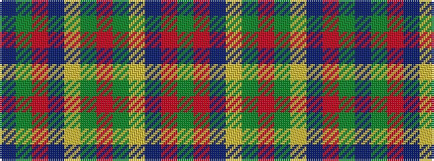

BGRBYGRGYBRG

It is a 12 stripe tartan.

<figure class="pat-woven">

<figcaption>idealised sample</figcaption>
</figure>

## Colour Sequence



## Tartans with this colour sequence

| Tartans |
|---------------|
| [Kilkenny, County](/setts/s12/dg27o2db25lo5dg3o3dg3lo5db25o2dg27dr4~x2/)|
||
