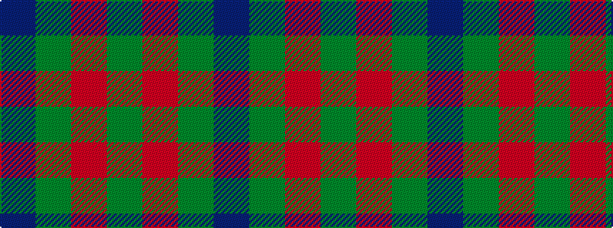

BGRG

It is a [4 stripe pattern](/stripes/stripes4/) — every 4-stripe pattern is gathered there.

<figure class="pat-woven">

<figcaption>idealised sample</figcaption>
</figure>

## Colour Sequence



## Tartans with this colour sequence

This pattern is a design lineage: every tartan below shares one colour order, whatever its owner —
near-identical designs are grouped, the largest lineage first (#112: the pattern is a tartan's
second parent, beside its family or clan).

<table class="sett-table">
<tbody>
<tr><td><a href="/tartans/0-9/0-9/13-irish-regiment/">13, Irish Regiment</a></td></tr>
<tr><td class="sett-swatch"></td></tr>
<tr class="cluster-sep"><td></td></tr>
<tr><td><a href="/tartans/w/wi/wilson-s-no-192/">Wilson's No.192</a> <small class="dt">ΔTartan 3.56</small></td></tr>
<tr><td class="sett-swatch"></td></tr>
<tr class="cluster-sep"><td></td></tr>
<tr><td><a href="/tartans/h/hi/highland-spring-2/">Highland Spring</a> <small class="dt">ΔTartan 17.50</small></td></tr>
<tr><td class="sett-swatch"></td></tr>
</tbody>
</table>

