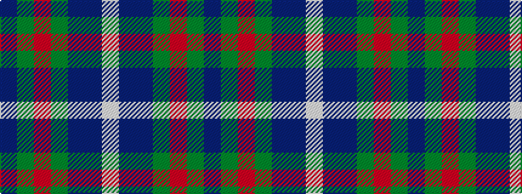

BGRGBBW

It is a 7 stripe tartan.

<figure class="pat-woven">

<figcaption>idealised sample</figcaption>
</figure>

## Colour Sequence



## Tartans with this colour sequence

| Tartans |
|---------------|
| [Manx National](/variants/s7/p2g6r1y1db3b10w1~x2/)|
||
| [Manx National](/variants/s7/p8g31r4y4db17b64w4/)|
||
