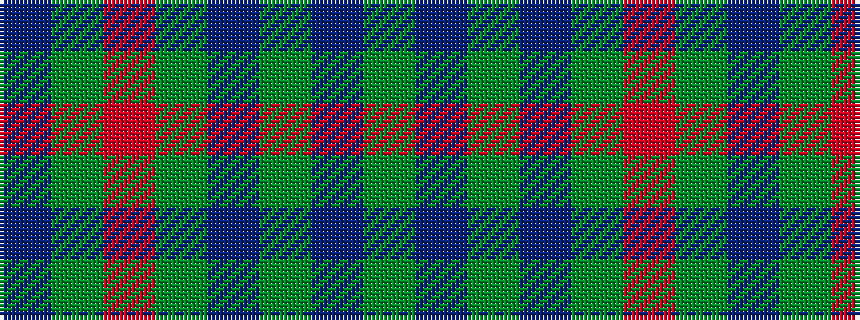

BGRGBGBG

It is a 8 stripe tartan.

<figure class="pat-woven">

<figcaption>idealised sample</figcaption>
</figure>

## Colour Sequence



## Tartans with this colour sequence

| Tartans |
|---------------|
| [Land's End Blue](/variants/s8/dg2dt26g2dt2g9r2g9dt2~x2/)|
||
| [Land's End, Blue (Fashion)](/variants/s8/dg2dt26dg2dt2dg9r2dg9dt2~x2/)|
||
