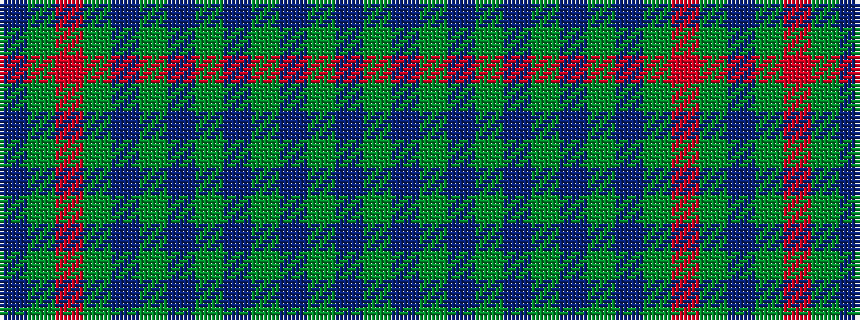

BGRGBGBGBGBGBG

It is a 14 stripe tartan.

<figure class="pat-woven">

<figcaption>idealised sample</figcaption>
</figure>

## Colour Sequence



## Tartans with this colour sequence

| Tartans |
|---------------|
| [Devarr](/setts/s14/do22y26r4y26do22dy3do3dy3do3dy31do3dy3do3dy3~x2/)|
||
