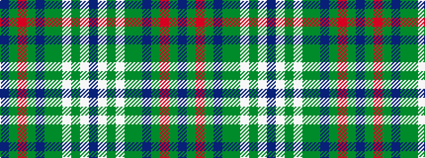

BGRGBGGWGWB

It is a 11 stripe tartan.

<figure class="pat-woven">

<figcaption>idealised sample</figcaption>
</figure>

## Colour Sequence



## Tartans with this colour sequence

| Tartans |
|---------------|
| [Nance (2002)](/variants/s11/dp52y14o2g3dp2g3y6lb6g2lb6dp2~x2/)|
||
