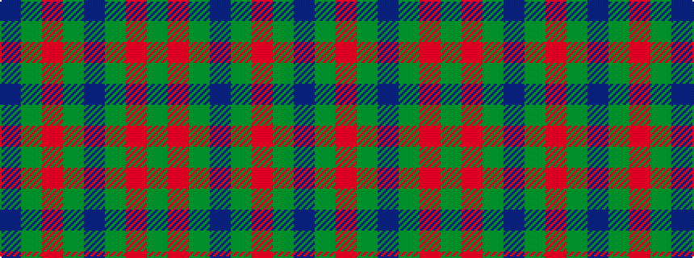

BGRGBGRG

It is a 8 stripe tartan.

<figure class="pat-woven">

<figcaption>idealised sample</figcaption>
</figure>

## Colour Sequence



## Tartans with this colour sequence

| Tartans |
|---------------|
| [Glenlivet](/variants/s8/g18r6g75db6g13o35g12db6/)|
||
