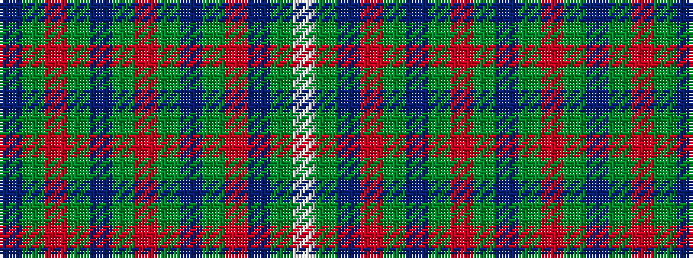

BGRGBGRGBGRBGW

It is a 14 stripe tartan.

<figure class="pat-woven">

<figcaption>idealised sample</figcaption>
</figure>

## Colour Sequence



## Tartans with this colour sequence

| Tartans |
|---------------|
| [Spey](/variants/s14/db1y1r1y1db1y1r1y1db1y1r1t1y1w1~x8/)|
||
