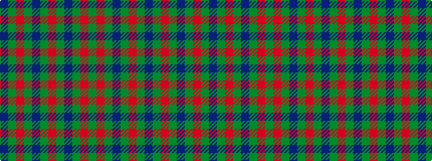

BGRGBGRGBGRG

It is a 12 stripe tartan.

<figure class="pat-woven">

<figcaption>idealised sample</figcaption>
</figure>

## Colour Sequence



## Tartans with this colour sequence

| Tartans |
|---------------|
| [Scottish Piping Society of London](/variants/s12/y21r3y21db5y3r30y3db5y21r3y21db2~x2/)|
||
