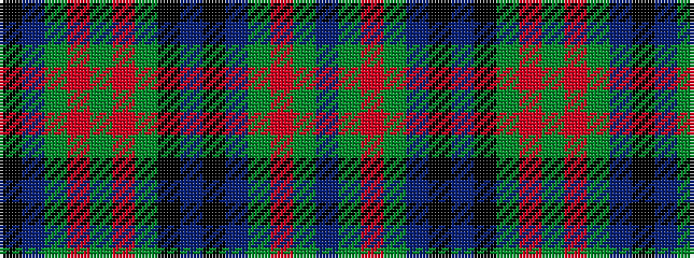

BGRGBKBKGRGRGBK

It is a 15 stripe tartan.

<figure class="pat-woven">

<figcaption>idealised sample</figcaption>
</figure>

## Colour Sequence



## Tartans with this colour sequence

| Tartans |
|---------------|
| [MacInroy Hunting](/setts/s15/k2db2g24r2g2r12g3k12db11k3db11g2r2g24db2~x2/)|
||
