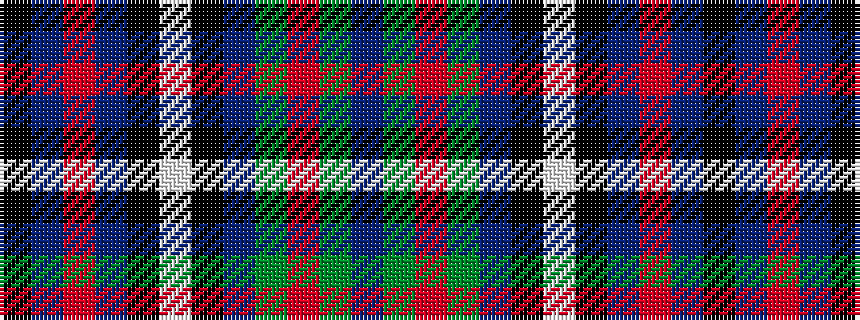

BGRGBKWKBRBK

It is a 12 stripe tartan.

<figure class="pat-woven">

<figcaption>idealised sample</figcaption>
</figure>

## Colour Sequence



## Tartans with this colour sequence

| Tartans |
|---------------|
| [Cascade Summers, (The Resort at the Mountain)](/variants/s12/k3t14r11db3k10w2k10db3dg6r3g14db3~x2/)|
||
