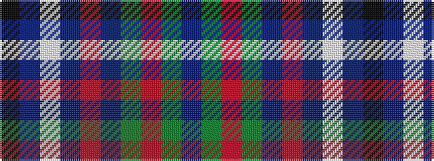

BGRGBRBWBK

It is a 10 stripe tartan.

<figure class="pat-woven">

<figcaption>idealised sample</figcaption>
</figure>

## Colour Sequence



## Tartans with this colour sequence

| Tartans |
|---------------|
| [Scottish Lion Name Tartan Tartan Number: 3184. Earliest known date: Not Specified Designed by Arthur Mackie of Strathmore Woollen Co. to celebrate the long working relationship with the Scottish Lion Import Shop and Mail Order Catalogue. Personal to the Scottish Lion Shop. See products available Copyright © Blair Urquhart, Comrie, 2015](/setts/s10/k4db16lb2db16r4dp7dg21r3dg4do3~x2/)|
||
