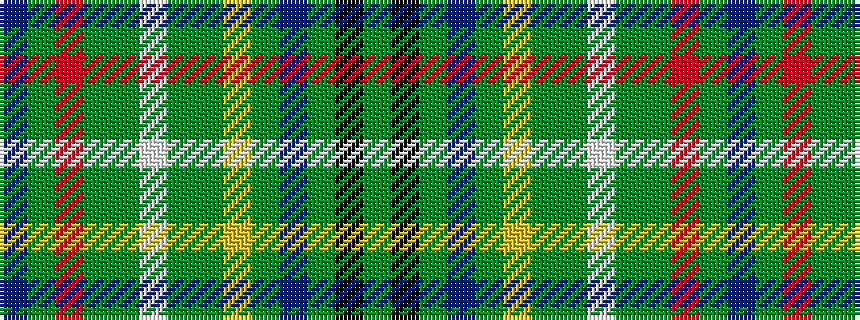

BGRGGWGGYGBGKG

It is a 14 stripe tartan.

<figure class="pat-woven">

<figcaption>idealised sample</figcaption>
</figure>

## Colour Sequence



## Tartans with this colour sequence

| Tartans |
|---------------|
| [Hyndman (Personal)](/setts/s14/db12dg24r5dy20dg4w2dg4dy21ly5dg24db12dy4k2dy4~x2/)|
||
