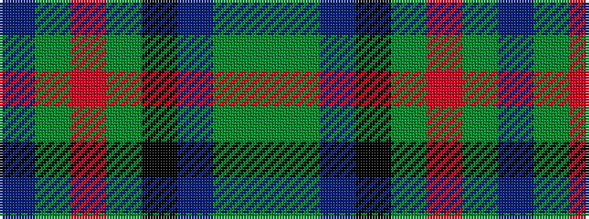

BGRGKBGG

It is a 8 stripe tartan.

<figure class="pat-woven">

<figcaption>idealised sample</figcaption>
</figure>

## Colour Sequence



## Tartans with this colour sequence

| Tartans |
|---------------|
| [Scottish Power (Corporate)](/variants/s8/dg5g32dp5k10dg8r3dg8dp3~x2/)|
||
| [Womens Rural Institute](/variants/s8/dg4g24dp4k6dg4r3dg4dp3~x2/)|
||
