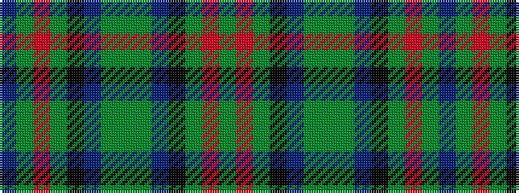

BGRGKBGGGBKGRG

It is a 14 stripe tartan.

<figure class="pat-woven">

<figcaption>idealised sample</figcaption>
</figure>

## Colour Sequence



## Tartans with this colour sequence

| Tartans |
|---------------|
| [Scottish Power Corporate Tartan Tartan Number: 2435. Earliest known date: pre 1996 Designed by Lochcarron for Scottish Power using the main corporate colours and taking care to produce a sett that could be seen as pipe band kilts at a distance. Scottish Power say (9.12.02) that Kinloch Anderson deal with this tartan and that permission to order/wear it is required from Scottish Power, Corporate Communications, 0141 566 4856. . See products available Copyright © Blair Urquhart, Comrie, 2015](/setts/s14/dg8r3dg8k10dp5g32dg5g32dp5k10dg8r3dg8dp3~x2/)|
|![Scottish Power Corporate Tartan Tartan Number: 2435. Earliest known date: pre 1996 Designed by Lochcarron for Scottish Power using the main corporate colours and taking care to produce a sett that could be seen as pipe band kilts at a distance. Scottish Power say (9.12.02) that Kinloch Anderson deal with this tartan and that permission to order/wear it is required from Scottish Power, Corporate Communications, 0141 566 4856. . See products available Copyright © Blair Urquhart, Comrie, 2015 example sett](/setts/s14/dg8r3dg8k10dp5g32dg5g32dp5k10dg8r3dg8dp3~x2/sett.png)|
