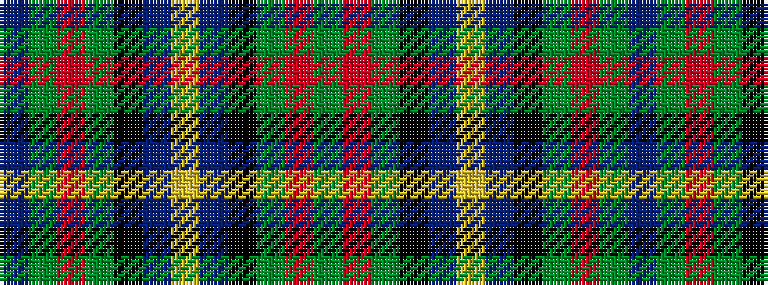

BGRGKBYBKGRG

It is a 12 stripe tartan.

<figure class="pat-woven">

<figcaption>idealised sample</figcaption>
</figure>

## Colour Sequence



## Tartans with this colour sequence

| Tartans |
|---------------|
| [Isle of Gigha](/setts/s12/dg4m1dg4k4db4lo1db4k4dg4m1dg4db2~x8/)|
||
