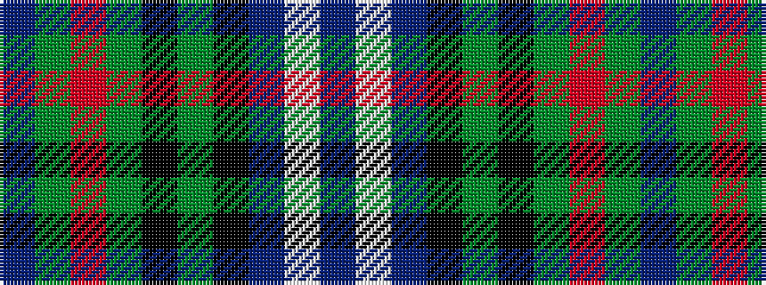

BGRGKGKBWB

It is a 10 stripe tartan.

<figure class="pat-woven">

<figcaption>idealised sample</figcaption>
</figure>

## Colour Sequence



## Tartans with this colour sequence

| Tartans |
|---------------|
| [Big Rory (Corporate)](/setts/s10/n10w5n48k35g5k5g35r5g5dp5/)|
||
