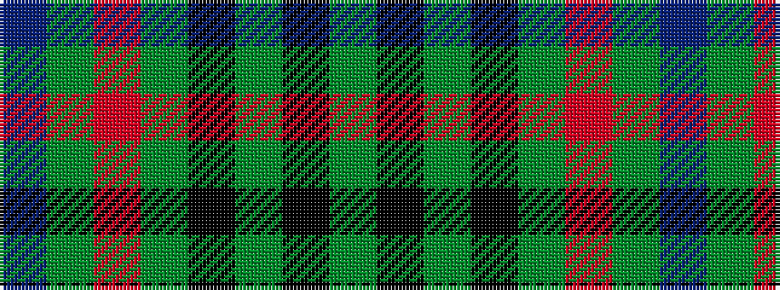

BGRGKGKG

It is a 8 stripe tartan.

<figure class="pat-woven">

<figcaption>idealised sample</figcaption>
</figure>

## Colour Sequence



## Tartans with this colour sequence

| Tartans |
|---------------|
| [Strath Halladale (Sutherland)](/variants/s8/dg5k15dg5k15dg19r2dg10b4~x2/)|
||
