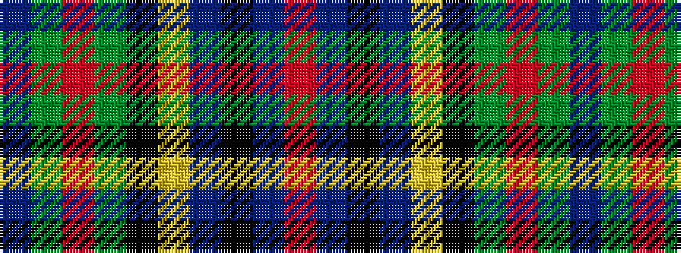

BGRGKYBKBR

It is a 10 stripe tartan.

<figure class="pat-woven">

<figcaption>idealised sample</figcaption>
</figure>

## Colour Sequence



## Tartans with this colour sequence

| Tartans |
|---------------|
| [Loch Freuchie](/variants/s10/n3dg3r2dg20k25ly2ni13k2ni3r3~x2/)|
||
