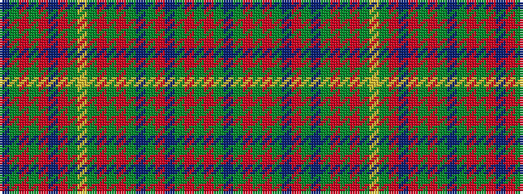

BGRGRBRGYGRGRGBGRBGRGRGB

It is a 24 stripe tartan.

<figure class="pat-woven">

<figcaption>idealised sample</figcaption>
</figure>

## Colour Sequence



## Tartans with this colour sequence

| Tartans |
|---------------|
| [Ettrick (Green) District Tartan Tartan Number: 2300. Earliest known date: 1971 Ettrick District is in the Borders of Scotland. See products available Copyright © Blair Urquhart, Comrie, 2015](/setts/s24/dt2dg2r1dg5r1dt6r2dg1ly1dg1r1dg1r1dg1t1dg1r2dt6dg20r1dg1r1dg1dt2~x2/)|
||
| [Ettrick Forest](/setts/s24/db2g2r1g4r1db6r2g1ly1g1r1g1r1g1t1g1r2db6g26r1g1r1g1db1~x2/)|
||
