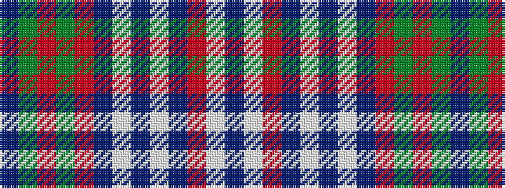

BGRGRBWBWBRWB

It is a 13 stripe tartan.

<figure class="pat-woven">

<figcaption>idealised sample</figcaption>
</figure>

## Colour Sequence



## Tartans with this colour sequence

| Tartans |
|---------------|
| [Fyvie, Magenta (Dance)](/setts/s13/dpi12dg1r4dg1r4dp5lt3dp5w34dp5r2lt2dpi4~x2/)|
||
