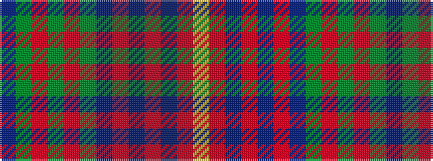

BGRGRGBRBRBRY

It is a 13 stripe tartan.

<figure class="pat-woven">

<figcaption>idealised sample</figcaption>
</figure>

## Colour Sequence



## Tartans with this colour sequence

| Tartans |
|---------------|
| [Cuthill (Personal)](/setts/s13/db3g4r2g3r3g16dt16ri16db3ri3db2ri4ly3~x2/)|
||
