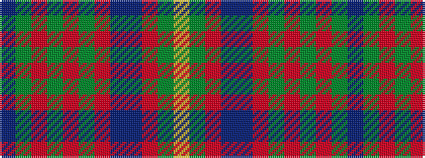

BGRGRGRBBRGY

It is a 12 stripe tartan.

<figure class="pat-woven">

<figcaption>idealised sample</figcaption>
</figure>

## Colour Sequence



## Tartans with this colour sequence

| Tartans |
|---------------|
| [Gordonstoun](/setts/s12/ly3g15r2db8t2r8g8r2dg15r2dg2t2~x2/)|
||
| [Gordonstoun Corporate Tartan Tartan Number: 190. Earliest known date: 1966 The specimen in the cloth archive of the Scottish Tartans Society was supplied by Bullard in 1969. The original sindex card says it was supplied by Gordon Stewart in 1966. See products available Copyright © Blair Urquhart, Comrie, 2015](/setts/s12/ly3g15m2db8t2m8g8m2dg15m2dg2t2~x2/)|
||
