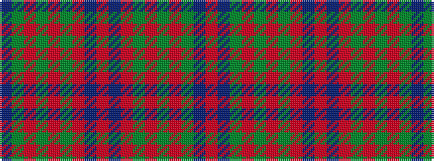

BGRGRGRBRBRGRGRGBR

It is a 18 stripe tartan.

<figure class="pat-woven">

<figcaption>idealised sample</figcaption>
</figure>

## Colour Sequence



## Tartans with this colour sequence

| Tartans |
|---------------|
| [Gray (Personal)](/setts/s18/n33g10r3g3r3g3r8n10r3n10r8g3r3g3r3g10n33r3~x2/)|
||
