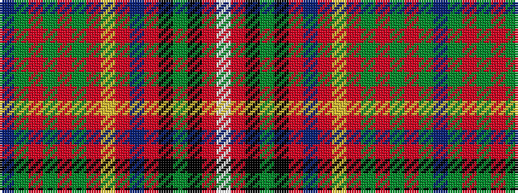

BGRGRGRYRBRKGKRW

It is a 16 stripe tartan.

<figure class="pat-woven">

<figcaption>idealised sample</figcaption>
</figure>

## Colour Sequence



## Tartans with this colour sequence

| Tartans |
|---------------|
| [MacInnes](/variants/s16/t1g6r1g1r1g1r6ly1r1db2r1k1g4k1r2w1~x4/)|
||
| [MacInnes (MacGregor-Hastie)](/variants/s16/t1dg6r1dg1r1dg1r6ly1r1db2r1k1dg4k1r2w1~x4/)|
||
