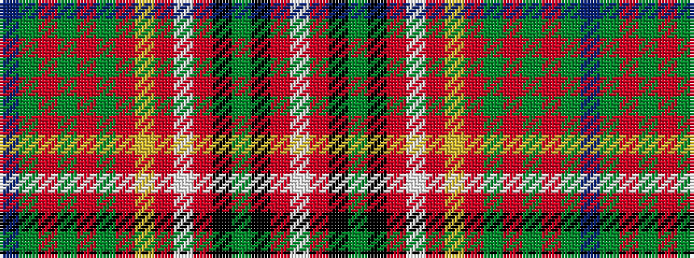

BGRGRGRYRWRKGKRW

It is a 16 stripe tartan.

<figure class="pat-woven">

<figcaption>idealised sample</figcaption>
</figure>

## Colour Sequence



## Tartans with this colour sequence

| Tartans |
|---------------|
| [MacInnes (MacGregor Hastie) (Clan)](/variants/s16/w2r2k1dg4k1r1w2r1ly1r6dg1r1dg1r1dg6t1~x4/)|
||
